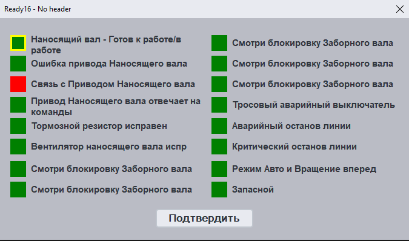
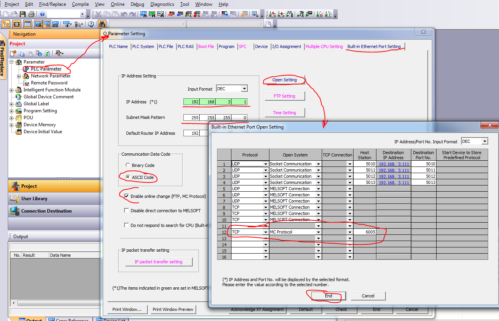

Ready16 для PLC Mitsubishi

Сделано на основе 
https://github.com/HslCommunication-Community/HslCommunication-Community/blob/master/docs/Melsec.md


Программа подключается к указанному в конфиге контроллеру по IP адресу и порту. Порт предварительно нужно открыть в конфиге PLC.
В программу передаются следующие аргументы: 
* заголовок в формате h:"Заголовок окна"
* адрес слова ready16 (сигнал) формата s:D800 где D800 - это адрес слова в PLC
* последний статус (last) формата l:D801 где D801 - это адрес слова в PLC
* адрес кнопки подтверждения (acknowledge) формата a:В802.1 где D802.1 - это адрес бита
* название файла откуда брать тексты блока Ready16 формата f:"filename.txt"



Для того чтобы запустить эту программу, например, из-под интача, можно к кнопке запуска приязать такой скрипт:

```vb
FileDelete ("c:\Ready16\text.txt");
DIM f AS MESSAGE;
f =" f:"+StringChar(34)+ "\Ready16\text.txt"+StringChar(34);
FileWriteMessage("c:\Ready16\text.txt",-1,"Готов к работе/в работе",1);
FileWriteMessage("c:\Ready16\text.txt",-1,"Ошибка Привода",1);
FileWriteMessage("c:\Ready16\text.txt",-1,"Связь с Приводом ОК",1);
FileWriteMessage("c:\Ready16\text.txt",-1,"Привод отвечает на команды ",1);
FileWriteMessage("c:\Ready16\text.txt",-1,"Ошибка Тормоза",1);
FileWriteMessage("c:\Ready16\text.txt",-1,"Разъединитель силовой цепи",1);
DIM h AS MESSAGE;
h =" h:"+StringChar(34)+ "40 - Станция Натяжения №2 Ролик №1"+StringChar(34);

StartApp "C:\Ready16\Ready16.exe "+h+f+" s:D800"+" l:D801"+" a:D802.1";
```
В нем как видно удаляется старый файл текстов, в него по строкам добавляется новый текст, и заголовок для окна. 
Затем запускается программа с заданными аргументами.

Вторая программа, может считывать слово из контроллера митсубиси, которое передается аргументом формата s:D800 где D800 - это адрес слова в PLC.
Значение этого слова пишется в реестр Windows, откуда это значение можно будет достать так же скриптами, например вот так:

```vb
DIM res AS MESSAGE;
OLE_CreateObject(%WS,"Wscript.Shell");
%WS.RegWrite("HKEY_CURRENT_USER\Software\ready16\value",0,"REG_DWORD");

res = %WS.Run("C:\Ready16\ReadWord.exe s:D800",2,1);
result = %WS.RegRead("HKEY_CURRENT_USER\Software\ready16\value");
```

Со стороны контроллера необходимо прогрузить настройки встроенного Ethernet порта на протокол MC. 
При этом обратить внимание что формат данных выбран ASCII и стоит галочка online change, чтобы можно было осуществлять запись в контроллер.
Если необходим формат Binary, то в программе нужно поменять MelsecMcAsciiNet на MelsecMcNet
